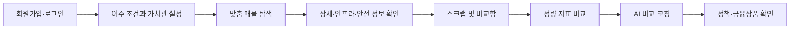
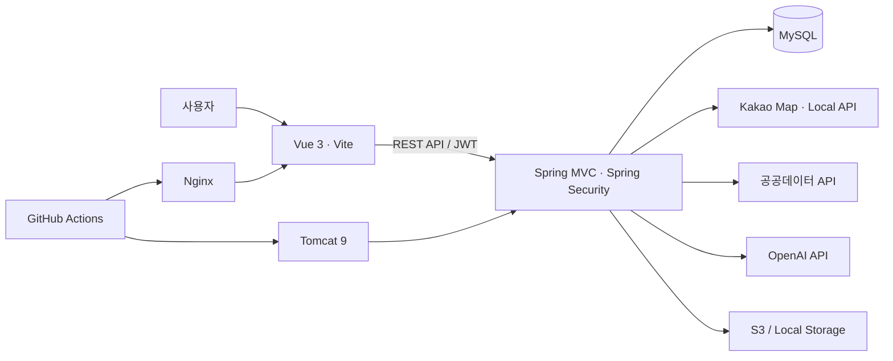

<div align="center">
  

  # 타지로 (Tajiro)

  **낯선 도시, 익숙한 시작**

  이주 예정자의 생활 가치관을 바탕으로 매물을 탐색·비교하고,<br />
  정착에 필요한 정책과 금융상품까지 연결하는 주거 의사결정 서비스입니다.
</div>

## 프로젝트 소개

낯선 지역으로 이사할 때는 가격과 면적뿐 아니라 출퇴근 거리, 생활 인프라, 안전 정보, 받을 수 있는 정책과 금융상품까지 함께 살펴봐야 합니다. 타지로는 흩어진 정보를 한곳에 모으고 사용자가 정한 우선순위를 점수와 비교 리포트에 반영해 주거 선택을 돕습니다.

### 핵심 가치

- **개인화**: 통근·예산·면적·인프라 등 사용자의 가치관을 매물 점수에 반영합니다.
- **비교 가능성**: 후보 매물 2~3개를 동일한 기준으로 비교하고 AI가 선택 근거를 요약합니다.
- **정착 지원**: 청년 정책과 금융상품을 사용자 및 매물 조건에 맞춰 함께 탐색합니다.
- **거래 안전성**: 주변 안전시설과 주의 지표를 매물 단위로 제공합니다.

## 주요 기능

| 영역 | 기능 |
| --- | --- |
| 회원·온보딩 | JWT 기반 회원가입·로그인, 일반/매도자 역할 분리, 사용자 프로필 및 가치관 설정 |
| 맞춤 매물 탐색 | 희망 지역·주거 형태·거래 유형·예산 조건을 반영한 매물 목록과 상세 정보 |
| 지도·생활 정보 | Kakao 지도 기반 위치 확인, 주변 교통·의료·교육·편의시설 조회 |
| 안전 정보 | 경찰서·CCTV·비상벨·보안등 등 주변 안전시설 및 안전 지표 제공 |
| 스크랩·비교함 | 관심 매물 저장, 2~3개 후보 매물 비교, 비교 리포트 보관 |
| AI 비교 코칭 | 사용자 우선순위와 매물별 정량 지표를 기반으로 추천 매물과 근거 생성 |
| 정책·금융 매칭 | 청년 정책 및 금융상품 검색·상세 조회·조건 기반 추천 |
| 매도자 기능 | 매물 등록, 이미지 업로드, 등록 매물 조회·상태 변경·삭제 |

## 서비스 흐름



## 시스템 구성



## 기술 스택

### Frontend

- Vue 3, Vite 6
- Pinia, Vue Router
- Axios
- Chart.js
- Lucide Vue
- Kakao Maps JavaScript SDK

### Backend

- Java 17
- Spring Framework 5.3, Spring MVC
- Spring Security, JWT
- MyBatis, HikariCP
- Gradle, Gretty, Tomcat 9
- JUnit 5

### Data·Infrastructure

- MySQL 8
- OpenAI API
- Kakao Local API, 건축물대장 API, 국토교통부 실거래가 API, 청년정책 API
- AWS S3 호환 이미지 저장소
- GitHub Actions, Nginx, Tomcat

## 프로젝트 구조

```text
Tajiro/
├── frontend/
│   ├── src/
│   │   ├── api/           # API 클라이언트와 서비스
│   │   ├── assets/        # 공통 스타일과 이미지
│   │   ├── components/    # 공통 UI 컴포넌트
│   │   ├── composables/   # 재사용 가능한 화면 로직
│   │   ├── constants/     # 온보딩·선호도 상수
│   │   ├── router/        # 화면 라우팅과 접근 제어
│   │   ├── stores/        # Pinia 상태 관리
│   │   └── views/         # 도메인별 화면
│   └── vite.config.js
├── backend/
│   ├── src/main/java/org/tajiro/
│   │   ├── auth/          # 인증·JWT 발급
│   │   ├── property/      # 매물·인프라·안전 정보
│   │   ├── comparison/    # 비교 지표와 AI 분석
│   │   ├── report/        # 비교 리포트
│   │   ├── preference/    # 사용자 가치관
│   │   ├── policy/        # 청년정책
│   │   ├── finance/       # 금융상품
│   │   ├── seller/        # 매도자와 매물 등록
│   │   └── user/          # 사용자 프로필
│   └── src/main/resources/ # MyBatis 매퍼와 로깅 설정
└── .github/workflows/     # CI/CD 구성
```

## 로컬 실행

### 사전 요구사항

- Java 17
- Node.js 20 LTS 권장
- MySQL 8
- Git

### 1. 저장소 복제

```bash
git clone https://github.com/tajiro-project/Tajiro.git
cd Tajiro
```

### 2. 데이터베이스 준비

```sql
CREATE DATABASE tajiro
  CHARACTER SET utf8mb4
  COLLATE utf8mb4_unicode_ci;
```

현재 저장소에는 DB 스키마·초기 데이터 마이그레이션 파일이 포함되어 있지 않습니다. 애플리케이션 실행 전 팀에서 공유하는 스키마와 초기 데이터를 `tajiro` 데이터베이스에 적용해야 합니다.

### 3. Backend 설정

`backend/src/main/resources/application.properties`를 생성합니다. 이 파일은 `.gitignore`에 포함되어 있으므로 실제 키와 비밀번호를 커밋하지 마세요.

<details>
<summary>로컬 설정 예시</summary>

```properties
app.name=Tajiro
app.api-base-package=org.tajiro

db.driver-class-name=net.sf.log4jdbc.sql.jdbcapi.DriverSpy
db.url=jdbc:log4jdbc:mysql://localhost:3306/tajiro?serverTimezone=Asia/Seoul&characterEncoding=UTF-8
db.username=YOUR_DB_USERNAME
db.password=YOUR_DB_PASSWORD

jwt.secret=REPLACE_WITH_A_LONG_RANDOM_SECRET
jwt.access-token-validity-seconds=3600

kakao.rest-api-key=YOUR_KAKAO_REST_API_KEY
kakao.local-base-url=https://dapi.kakao.com
building-ledger.service-key=YOUR_BUILDING_LEDGER_API_KEY

ai.api-key=YOUR_OPENAI_API_KEY
ai.model=gpt-4o-mini
ai.api-url=https://api.openai.com/v1/embeddings
ai.embedding-model=text-embedding-3-small

safety.aggregation.batch-size=20
safety.aggregation.fixed-delay-ms=60000
safety.aggregation.initial-delay-ms=10000

market.api.service-key=YOUR_PUBLIC_DATA_API_KEY
market.api.service-key-encoded=false
market.api.num-of-rows=1000
market.rent-conversion-rate=0.05
market.sync.enabled=false
market.sync.history-months=24
market.sync.refresh-months=3

youth-policy.api-url=https://www.youthcenter.go.kr/go/ythip/getPlcy
youth-policy.api-key=YOUR_YOUTH_POLICY_API_KEY
youth-policy.page-size=3000
policy.sync.enabled=false
policy.sync.cron=0 10 4 * * *
policy.sync.zone=Asia/Seoul
policy.summary.batch-size=20

property.image.storage-type=local
property.image.storage-directory=
spring.servlet.multipart.max-file-size=10MB
spring.servlet.multipart.max-request-size=11MB
```

API 키가 없는 기능은 해당 값을 빈 문자열로 둘 수 있지만, 관련 지도·AI·정책·시세 기능은 제한됩니다.

</details>

Backend 실행:

```powershell
cd backend
.\gradlew.bat appRun
```

기본 API 주소는 `http://localhost:8080`입니다.

### 4. Frontend 설정 및 실행

`frontend/.env`를 생성합니다.

```dotenv
VITE_KAKAO_MAP_KEY=YOUR_KAKAO_JAVASCRIPT_KEY
```

Frontend 실행:

```bash
cd frontend
npm ci
npm run dev
```

브라우저에서 `http://localhost:5173`에 접속합니다. 개발 서버의 `/api` 요청은 `http://localhost:8080`으로 프록시됩니다.

## 테스트 및 빌드

### Backend

```powershell
cd backend
.\gradlew.bat test
.\gradlew.bat war
```

### Frontend

```bash
cd frontend
npm run build
npm run preview
```

## 보안 유의사항

- DB 비밀번호, JWT Secret, OpenAI·Kakao·공공데이터 API 키를 저장소에 커밋하지 않습니다.
- Backend 비밀 설정은 `application.properties`, Frontend 비밀 설정은 `.env`에서 관리합니다.
- 운영 환경에서는 GitHub Actions Secrets 등 별도의 비밀정보 저장소를 사용합니다.
- 노출된 키는 즉시 폐기하고 새 키로 교체합니다.
